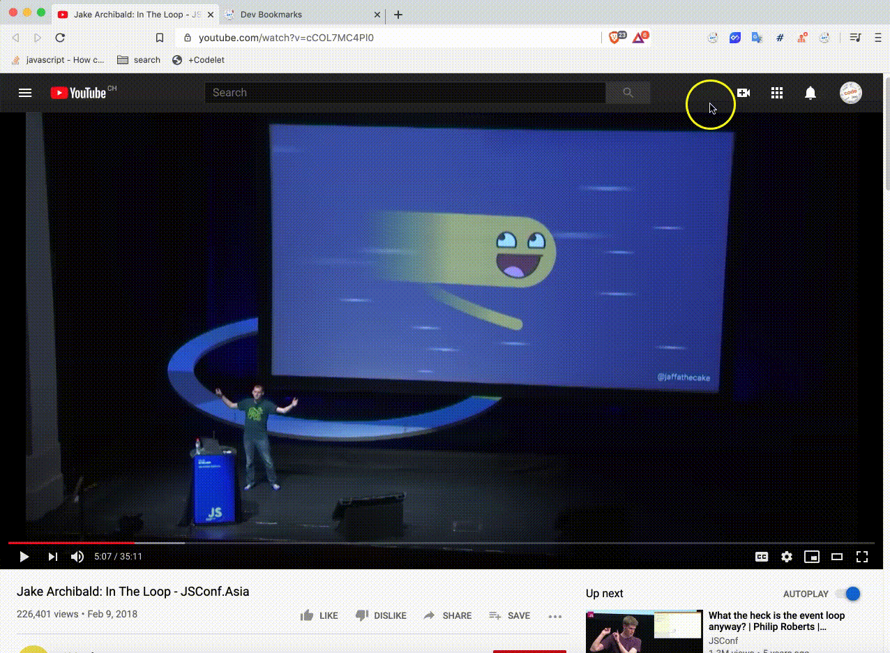

Save link to Bookmarks.dev Browser Extension
---
Browser extension to easily save links to [www.bookmarks.dev]((https://www.bookmarks.dev)),
 the Bookmarks and Code Snippets Manager for Developers & Co.
 
## Install
This browser extension is available for:

|  |  |
|:---:|:---:|
| [Chrome](https://chrome.google.com/webstore/detail/save-to-bookmarksdev/diofdblfhjbpgackifolmboaiccmebjb) |  |

> If your company blocks Browser Extensions, or you have a tight security blocking pop-up windows from extensions 
> you can use the [available bookmarklets](https://www.bookmarks.dev/howto/bookmarklets) which offer the same functionality 

## How to use  

Save current's tab URL to [Bookmarks.dev](https://www.bookmarks.dev). You need to have an account to begin with.

A popup window is launched where you can add the metadata for the bookmark. **Title** and **description** are auto completed.
 (the **description** is filled with `meta="description"` value if present on the website, unless to select text on the page,
  before clicking the extension and this will be then)

> For youtube videos and stackoverflow questions the **tags** and **published on** are also auto-completed

 

## Testing locally
Check out the git repository - `git clone https://github.com/BookmarksDev/bookmarks.dev-chrome-extension.git`

## Chrome/Brave
Go to [chrome://extensions/](chrome://extensions/), click **Load unpacked** and select the `bookmarks.dev-chrome-extension`
where you have checked it out:


> Click "Reload" on the extension when you do modifications 

### Firefox

#### Use [web-ext](https://github.com/mozilla/web-ext)
The easiest way is to use [web-ext](https://github.com/mozilla/web-ext)
 You can install it globally for example via
```
npm install --global web-ext
```
and then run the following command in the root directory of the project

```
web-ext run
```

This installs "Save link to Bookmarks.dev" as a temporary add-on and it watches for changes in the source code
and redploys automatically.

#### Manual deployment
Go to [about:debugging#/runtime/this-firefox](about:debugging#/runtime/this-firefox), click **Load Temporary Add-on...**
 and select the `manifest.json` file from the `save-code-to-bookmarks.dev-browser-extension` folder where you have checked it out:


### Test the extension against the [`localhost`](https://github.com/BookmarksDev/bookmarks.dev) version of Bookmarks.dev
Change the following line in [launch-bookmarksdev-dialog](launch-bookmarksdev-dialog.js):
```
open('https://www.bookmarks.dev/personal/new?url=' + encodeURIComponent(l) + '&desc=' + encodeURIComponent(d) + '&title=' + encodeURIComponent(t) + '&popup=true', 'Bookmarks.dev', features);
```
to
```
open('http://localhost:4200/personal/new?url=' + encodeURIComponent(l) + '&desc=' + encodeURIComponent(d) + '&title=' + encodeURIComponent(t) + '&popup=true', 'Bookmarks.dev', features);
```

and Reload the extension 

## Upload to Google Chrome Webstore

First of all package it as a zip file:
```shell
zip -r bookmarks.dev.chrome.extension.zip * -x *.idea* *.git* '*docs/*' "*README.md*"
```

Go to [Chrome Webstore Dashboard](https://chrome.google.com/webstore/developer/dashboard) where
you upload the .zip file. Wait for a couple of business days for an approval.


